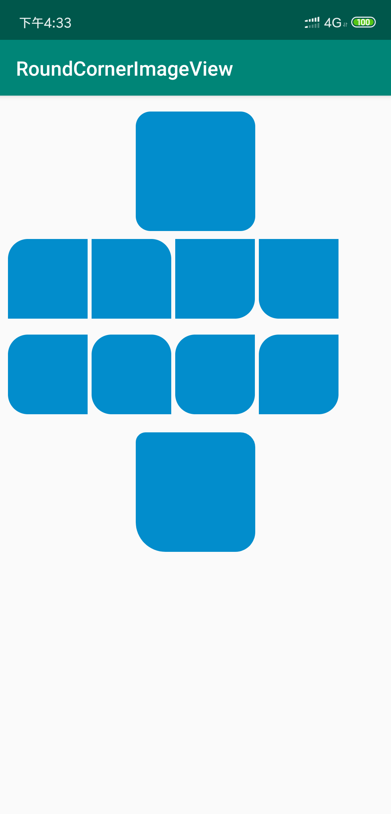

[]
(https://jitpack.io/#acntwww/RoundCornerImageView)

In some scenario we need round corner images, there is a lot of copy-past code in my projects. Here is this simple ImageView.

Install
---
Add it to your build.gradle with:
```gradle
allprojects {
    repositories {
        maven { url "https://jitpack.io" }
    }
}
```
and:

```gradle
dependencies {
    implementation 'com.github.acntwww:RoundCornerImageView:{latest version}'
}
```


Effects
--
All the corners can be defined via xml properties.    
```xml
    <com.acnt.android.widgets.radius.RoundCornerImageView
        android:layout_width="120dp"
        android:layout_height="120dp"
        android:layout_marginTop="10dp"
        android:src="@drawable/test"
        app:bottomLeftRadius="30dp"
        app:bottomRightRadius="20dp"
        app:topLeftRadius="10dp"
        app:topRightRadius="15dp" />
```


